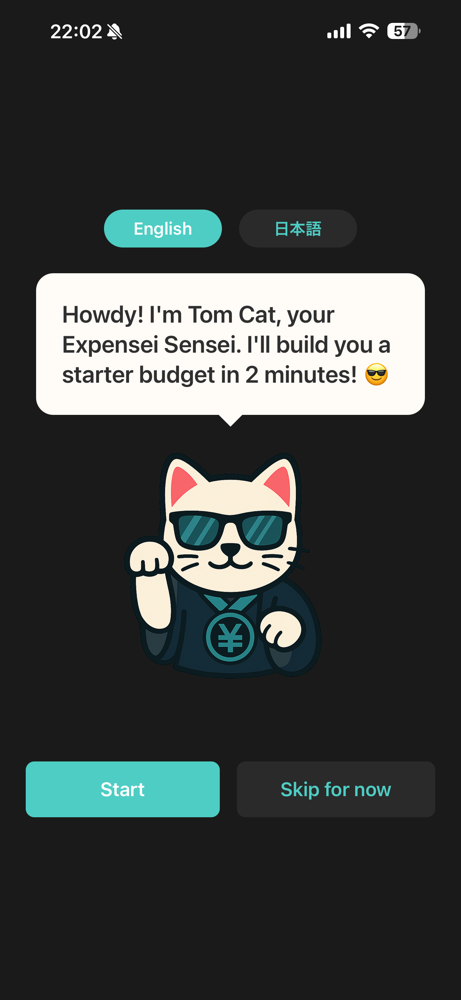
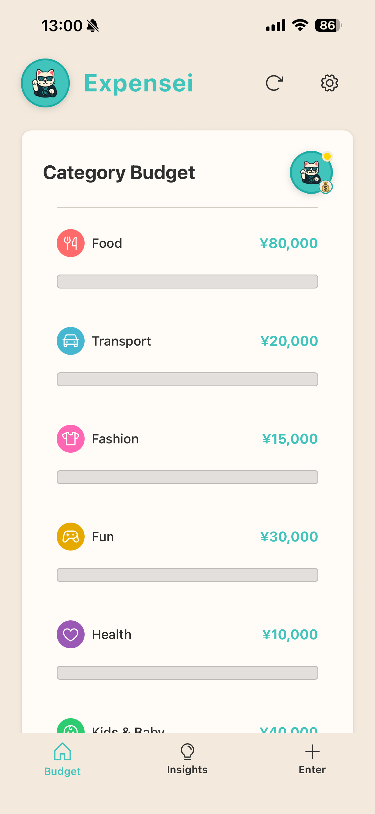
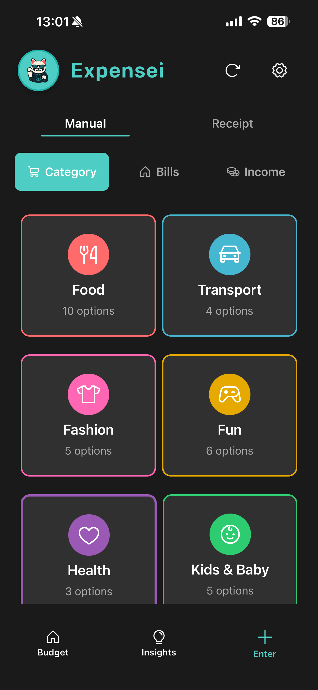
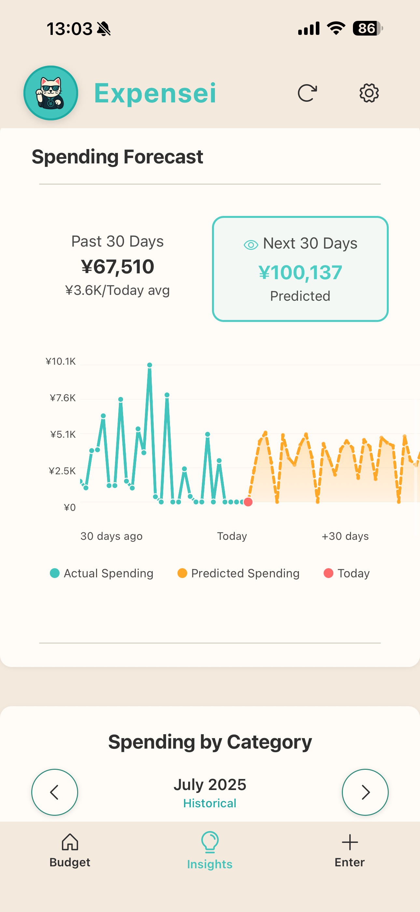

# 📱 Expensei Mobile  

  
  
  
  

Smart budget and expense tracker with **multi-currency support**, **OCR receipt scanning**, and **Stripe payments**, built for **bilingual (EN/JP) users**.  

---

## Highlights
- **Supabase backend** with Postgres + Auth  
- **Stripe payments + OCR**: fully implemented in earlier web app prototype, on roadmap for mobile  
- **Teal-based design system** with CategoryGrid for quick entry  
- **Bilingual toggle** (English / Japanese)  

---

<h2>Screenshots</h2>

<h2>Screenshots</h2>

  
  
  
  

---

## Roadmap
- Finish onboarding v2  
- Dashboard MVP polish  
- Port OCR pipeline (scan → categorize) from web  
- Port Stripe payments (premium flow) from web  
- Analytics + insights polish  

---

## Try It
- iOS TestFlight: invite available on request (send Apple ID to **tomcatlabs@gmail.com**)  
- Android: coming soon

---

## 📄 License
This showcase repo is licensed under the MIT License.  
Source code is proprietary and private.  
